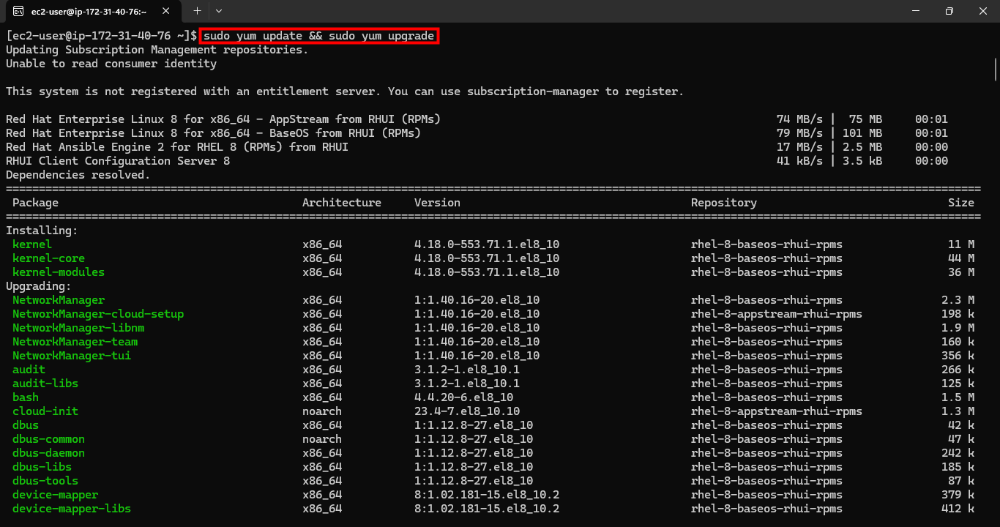
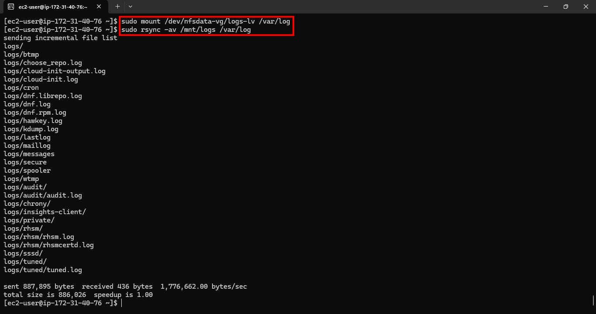
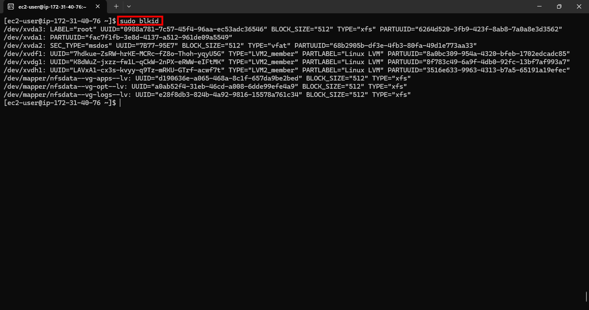
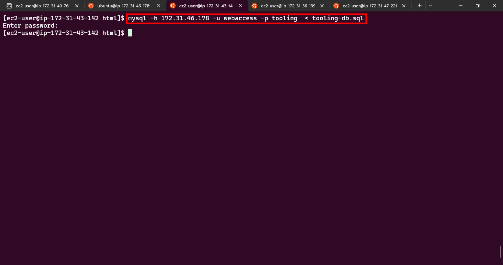

#  🚀 DevOps Tooling Website Solution – Making DevOps Tools Easily Accessible

## 📌 Introduction

In modern organizations, DevOps tools are scattered across multiple servers and environments. Engineers often waste time remembering credentials, IPs, and URLs for accessing these tools. To solve this problem, I implemented a Tooling Website Solution that centralizes access to DevOps tools within the corporate infrastructure.

This project demonstrates how to design, deploy, and integrate multiple components to build a robust and production-ready environment.

## 🏗️ Project Architecture

**The solution is built using the following stack:**

- **Infrastructure: AWS (Elastic Compute Cloud for servers)**
- **3 Webserver (Frontend): Red Hat Enterprise Linux 8 running Apache + PHP**
- **Database Server: Ubuntu 24.04 with MySQL**
- **Storage Server: RHEL 8 with NFS for file sharing**
- **Programming Language: PHP (for dynamic login and authentication logic)**
- **Code Repository: GitHub (for source control and collaboration)**

### Here’s the high-level design:

```pgsql
           [ User Browser ]
                  |
            [ Web Servers ]  (3x RHEL 8)
                  |
      -----------------------------
      |                           |
 [ Database Server ]       [ NFS Storage Server ]
   (MySQL on Ubuntu)         (RHEL 8 + LVM + NFS)

```

**This design ensures:**

- **Stateless Web Servers** → all files served from shared NFS.
- **Central Database** → single source of truth
- **Scalability** → add/remove web servers without data loss.

---

# DEPLOYMENT STEPS

## 🚀 Step 1: Prepare the NFS Server

We’ll begin by setting up a dedicated NFS server that will provide shared storage for all web servers in our 3-tier DevOps tooling architecture.

### 🔹 1. Spin up an EC2 instance

- Launch a new RHEL 8 instance in AWS.

- Attach three additional EBS volumes for use with LVM.

- SSH into the instance


### 🔹 2. Configure LVM for storage management

- We’ll use LVM to manage flexible storage for /mnt/apps, /mnt/opt, and /var/log.
    ```bash
    # Update system
    sudo yum update -y

    # Install LVM
    sudo yum install -y lvm2 gdisk
    ```
    
    
- Partition disks with gdisk, create physical volumes, volume group, and logical volumes:
    ```bash
    sudo gdisk /dev/xvdf
    # Inside gdisk:
    #  - 'n' to create a new partition (accept defaults for start/end to use the full disk)
    #  - type code: 8E00 (LVM)
    #  - 'w' to write and exit
    # Repeat for each raw disk (/dev/xvdf, /dev/xvdg, /dev/xvdh):
    ```
    
    ```bash
    sudo pvcreate /dev/xvdf1 /dev/xvdg1 /dev/xvdh1
    sudo vgcreate nfsdata-vg /dev/xvdf1 /dev/xvdg1 /dev/xvdh1
    sudo lvcreate -n apps-lv -L 14G nfsdata-vg
    sudo lvcreate -n opt-lv -L 14G nfsdata-vg
    sudo lvcreate -n logs-lv -L 14G nfsdata-vg
    ```
    
    
    
- Format and mount the logical volumes:
    ```bash
    sudo mkfs -t xfs /dev/nfsdata-vg/apps-lv
    sudo mkfs -t xfs /dev/nfsdata-vg/opt-lv
    sudo mkfs -t xfs /dev/nfsdata-vg/logs-lv

    sudo mkdir -p /mnt/apps /mnt/opt /mnt/logs
    sudo mount /dev/nfsdata-vg/apps-lv /mnt/apps
    sudo mount /dev/nfsdata-vg/opt-lv /mnt/opt
    sudo mount /dev/nfsdata-vg/logs-lv /mnt/logs
    ```
    
    
    
    
- Make mounts persistent by adding them to /etc/fstab.



### 🔹 3. Install and configure NFS server

```bash
sudo yum install -y nfs-utils
sudo systemctl enable --now nfs-server
```


- Make sure we set up permission that  will allow our web servers  to read, write and execute files on NFS
    ```bash
    sudo chown -R nobody: /mnt/apps
    sudo chown -R nobody: /mnt/logs
    sudo chown -R nobody: /mnt/opt


    sudo chmod -R 777 /mnt/apps
    sudo chmod -R 777 /mnt/logs
    sudo chmod -R 777 /mnt/opt


    sudo systemctl restart nfs-server.service
    ```
    

- Export the directories to your web server subnet (172.31.32.0/20 in this example):
    ```bash
    sudo nano /etc/exports

    /mnt/apps   172.31.32.0/20(rw,sync,no_all_squash,no_root_squash)
    /mnt/logs   172.31.32.0/20(rw,sync,no_all_squash,no_root_squash)
    /mnt/opt    172.31.32.0/20(rw,sync,no_all_squash,no_root_squash)
    ```
    
    

- Apply the changes:
    ```bash
    sudo exportfs -arv
    ```
    


### 🔹 4. Security group configuration

Ensure the following ports are open for your NFS server:

- TCP/UDP 111 (rpcbind)
- UDP 2049 (nfsd)
- NFS 2049
Customize source the CIDR of your web servers


## 🚀 Step 2: Configure the Database Server

The Database Server stores user credentials, tool configurations, and other application data. We’ll use MySQL on Ubuntu 24.04 and make it accessible only to our web server subnet.

### 🔹 1. Install MySQL Server
Launch another Instance Ubuntu 24.04 for your Database server


```bash
sudo apt update && sudo apt upgrade -y
sudo apt install mysql-server -y
sudo mysql_secure_installation
```


- Verify installation:
    ```bash
    mysql --version
    ```

### 🔹 2. Create the tooling database and user

- Log into MySQL:

    ```bash
    sudo mysql
    ```

- Run the following SQL commands:
    ```sql
    CREATE DATABASE tooling;

    CREATE USER 'webaccess'@'%' IDENTIFIED BY 'Strong.Password123';

    GRANT ALL PRIVILEGES ON tooling.* TO 'webaccess'@'%';

    FLUSH PRIVILEGES;
    EXIT;
    ```
    

- Confirm that the database was created:

    ```sql
    SHOW DATABASES;
    ```
    

You should see tooling listed.

### 🔹 3. Configure MySQL for remote access

By default, MySQL binds only to 127.0.0.1. We need to allow connections from the web server subnet.

```bash
sudo nano /etc/mysql/mysql.conf.d/mysqld.cnf
```

Find:

`bind-address = 127.0.0.1`


Replace with:

`bind-address = 0.0.0.0`


- Restart MySQL:
    ```bash
    sudo systemctl restart mysql
    sudo systemctl enable mysql
    ```

### 🔹 4. Restrict access to web server subnet

To improve security, restrict the webaccess user to connections only from the web tier subnet (e.g., 172.31.32.0/20):

```sql
CREATE USER 'webaccess'@'172.31.32.%' IDENTIFIED BY 'Strong.Password123';
GRANT ALL PRIVILEGES ON tooling.* TO 'webaccess'@'172.31.32.%';
FLUSH PRIVILEGES;
```

✅ At this point, your database server is ready and only your web servers (inside the correct subnet) can connect.

---

## 🔹 Step 3: Prepare the Web Servers

Now that the NFS Storage and Database Server are ready, we can configure the Web Tier. Our goal is to make the three web servers stateless so they all serve identical content from NFS and connect to the same MySQL database.

This ensures scalability — we can add or remove web servers without losing data integrity. Launch three web servers using RHEL 8 as your AMI and SSH into them


### 1️⃣ Configure NFS Client (on all 3 Web Servers)

- Install NFS client:
    ```bash
    sudo yum install nfs-utils nfs4-acl-tools -y
    ```
    

- Mount the NFS export for application files (/mnt/apps) to Apache’s web root (/var/www):
    ```bash
    sudo mkdir -p /var/www
    sudo mount -t nfs -o rw,nosuid 172.31.40.76:/mnt/apps /var/www
    ```

- Verify with:
    ```bash
    df -h
    ```
    

- Make the mount persistent across reboots:
    ```bash
    sudo nano /etc/fstab
    ```
    

- Add:
    ```
    172.31.40.76:/mnt/apps /var/www nfs defaults 0 0
    ```
    

### 2️⃣ Install Apache & PHP
```bash
sudo yum install httpd -y
sudo dnf install https://dl.fedoraproject.org/pub/epel/epel-release-latest-8.noarch.rpm -y
sudo dnf install https://rpms.remirepo.net/enterprise/remi-release-8.rpm -y
sudo dnf install dnf-utils -y

sudo dnf module reset php -y
sudo dnf module enable php:remi-7.4 -y
sudo dnf install php php-opcache php-gd php-curl php-mysqlnd -y

sudo systemctl start httpd php-fpm
sudo systemctl enable httpd php-fpm
sudo setsebool -P httpd_execmem 1
```


Repeat on all 3 web servers.

### 3️⃣ Test File Sharing Across Web Servers


- On Web Server 1:
    ```bash
    cd /var/www
    sudo touch test.txt
    ls -l
    ```
    

- On Web Server 2 or 3:
    ```bash
    ls -l /var/www
    ```
    

- On NFS Server:
    ```bash
    ls -l /mnt/apps
    ```,
    

**➡️ If you see test.txt everywhere, NFS is mounted correctly.**

### 4️⃣ Centralize Apache Logs on NFS

Apache logs are stored in /var/log/httpd. We’ll mount them to NFS.

- On each web server:
    ```bash
    sudo systemctl stop httpd
    sudo mv /var/log/httpd /var/log/httpd.bak
    sudo mkdir /var/log/httpd
    sudo mount -t nfs -o rw,nosuid 172.31.40.76:/mnt/logs /var/log/httpd
    ```
    

- Persist in /etc/fstab:
    ```
    172.31.40.76:/mnt/logs /var/log/httpd nfs defaults 0 0
    ```
    
    

- Restart Apache:
    ```bash
    sudo systemctl start httpd
    sudo systemctl enable httpd
    ```

### 5️⃣ Deploy the Tooling Application

- Install Git:
    ```bash
    sudo yum install git -y
    ```
    

- Clone your repository into /var/www/html:
    ```bash
    cd /var/www
    sudo mkdir -p html
    cd html
    sudo git clone https://github.com/princemaxi/tooling .
    ```
    
    

- Set permissions:
    ```bash
    sudo chown -R apache:apache /var/www/html
    sudo chmod -R 755 /var/www/html
    ```

- Restart Apache:
    ```bash
    sudo systemctl restart httpd
    ```
    
    

**➡️ Ensure TCP port 80 is open in the security group.**

### 6️⃣ Connect Website to Database

- Edit the DB connection file:
    ```bash
    sudo nano /var/www/html/functions.php
    ```
    

- Update credentials:
    ```
    $servername = "172.31.46.178";   // DB private IP
    $username   = "webaccess";
    $password   = "Strong.Password123";
    $dbname     = "tooling";
    ```
    

- Apply database schema:
    ```sql
    sudo yum install mysql -y
    mysql -h 172.31.46.178 -u webaccess -p tooling < tooling-db.sql
    ```
    
    

- Verify schema:
    ```sql
    mysql -h 172.31.46.178 -u webaccess -p tooling
    mysql> SHOW TABLES;
    ```
    

### 7️⃣ Create Admin User

- Log into MySQL:
    ```sql
    mysql -h 172.31.46.178 -u webaccess -p tooling
    ```

- Insert a new admin user:
    ```sql
    INSERT INTO users (id, username, password, email, user_type, status) 
    VALUES (4, 'max', MD5('P@ssw0rd123!'), 'newuser@mail.com', 'admin', 1);
    ```
    

### 8️⃣ Test the Website

Open your web server’s public IP in a browser.

- **➡️ You should see the Tooling Website login page.**

- **➡️ Log in with your admin credentials.**


✅ At this point, you have 3 web servers running in sync, sharing storage over NFS, and using a single MySQL database.

---

## 🎯 Conclusion

We’ve successfully deployed a 3-tier DevOps Tooling Website Solution on AWS:

- NFS provides shared storage across web servers
- MySQL acts as the central database.
- RHEL web servers run the PHP tooling application in sync.

This setup makes the application scalable, fault-tolerant, and production-ready. With load balancers and auto-scaling, we could take this even further into a full enterprise deployment.

---

## 🛠️ Troubleshooting Guide

During the deployment, a few common issues came up. Here are troubleshooting steps you can follow if you run into problems:

#### 1️⃣ Database Connection Issues

> Problem:
> 
> Web application cannot connect to the MySQL database.
> 
> 
> 
> Checks & Fixes:
> 
> 
> 
> Verify MySQL is listening on all interfaces:
```
sudo ss -tulnp | grep 3306
```

> Confirm security groups allow inbound traffic on port 3306 from web servers’ subnet.
> 
> 
> 
> Test connectivity from a web server:
```
mysql -h <DB_PRIVATE_IP> -u webaccess -p
```

> Ensure the database user was granted permissions correctly:
```
SHOW GRANTS FOR 'webaccess'@'%';
```
#### 2️⃣ NFS Mount Errors

> Problem:
> 
> Web server fails to mount the NFS share.
> 
> 
> 
> Checks & Fixes:
> 
> 
> 
> Confirm NFS service is running on the NFS server:
> 
> 
> 
> sudo systemctl status nfs-server
> 
> 
> 
> Verify exports:
```
sudo exportfs -v
```

> Check that the web server subnet is included in /etc/exports.
> 
> 
> 
> From a web server, test:
```
showmount -e <NFS_SERVER_IP>
```

#### 3️⃣ Apache Service Issues

> Problem:
> 
> Web pages not loading or Apache fails to start.
> 
> 
> 
> Checks & Fixes:
> 
> 
> 
> Check logs (centralized or backup directory):

```
sudo tail -f /var/log/httpd/error_log
```

> Ensure PHP is properly enabled:
```
php -v
```

> Restart Apache and PHP-FPM:
```
sudo systemctl restart httpd php-fpm
```
#### 4️⃣ PHP-MySQL Extension Errors

> Problem:
> 
> Application shows errors like “Call to undefined function mysqli_connect()”.
> 
> 
> 
> Checks & Fixes:
>
>Ensure php-mysqlnd is installed:
```
sudo dnf install php-mysqlnd -y
```

> Restart services after installation:
```
sudo systemctl restart httpd php-fpm
```
#### 5️⃣ Schema Import Errors

> Problem:
> 
> tooling-db.sql import fails with errors.
> 
> 
> 
> Checks & Fixes:
> 
> 
> 
> Ensure you are importing into the right DB:
```
mysql -h <DB_IP> -u webaccess -p tooling < tooling-db.sql
```

> Confirm user has rights to create tables.
> 
> 
> 
> Check for duplicate imports — drop the DB and recreate if needed:
```
DROP DATABASE tooling;
CREATE DATABASE tooling;
```
#### 6️⃣ Application Login Failure

> Problem:
> 
> Admin user cannot log in.
> 
> 
> 
> Checks & Fixes:
> 
> 
> 
> Verify that the user was inserted correctly:
```
SELECT * FROM users WHERE username='max';
```

```> Password must be stored using MD5() hashing as per app schema:
> 
```
INSERT INTO users (id, username, password, email, user_type, status) 
VALUES (4, 'max', MD5('P@ssw0rd123!'), 'admin@mail.com', 'admin', 1);
```

✅ With these checks in place, most deployment and runtime issues can be quickly resolved.